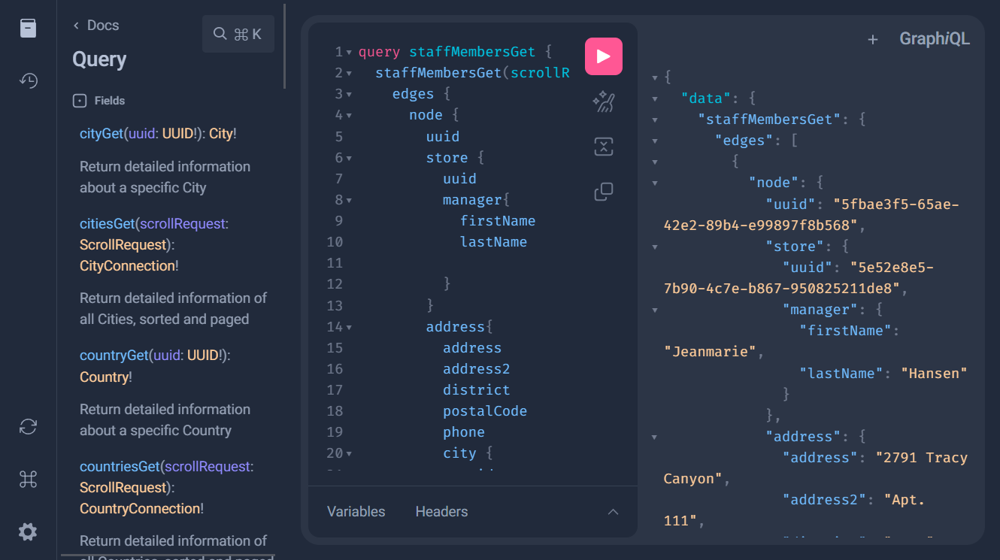

<!-- Improved compatibility of back to top link: See: https://github.com/othneildrew/Best-README-Template/pull/73 -->

<a name="readme-top"></a>

[![Forks][forks-shield]][forks-url]
[![Stargazers][stars-shield]][stars-url]
[![Issues][issues-shield]][issues-url]
[![MIT License][license-shield]][license-url]
[![LinkedIn][linkedin-shield]][linkedin-url]

<!-- PROJECT LOGO -->
<br />
<div align="center">
    <h3 align="center">graphqlSakila</h3>

  <p align="center">
    Demonstrations of my proficiency span across several technologies. Concretely, this project is an API facilitating CRUD operations (Create, Read, Update, Delete (TODO)) for various objects. You can explore the <a href="https://graphql-voyager.web.app/?url=https://graphqlSakila.zucchi.dev/graphql">object relationship schema here</a>, which is heavily inspired by <a href="https://dev.mysql.com/doc/sakila/en/">Sakila Sample Database</a>.
    <br />
    <a href="https://github.com/sisimomo/graphqlSakila"><strong>Explore the docs »</strong></a>
    <br />
    <br />
    <a href="https://graphqlSakila.zucchi.dev/graphiql">View Demo</a>
    ·
    <a href="https://github.com/sisimomo/graphqlSakila/issues">Report Bug</a>
    ·
    <a href="https://github.com/sisimomo/graphqlSakila/issues">Request Feature</a>
  </p>
</div>

<!-- TABLE OF CONTENTS -->
<details>
  <summary>Table of Contents</summary>
  <ol>
    <li>
      <a href="#about-the-project">About The Project</a>
      <ul>
        <li><a href="#built-with">Built With</a></li>
      </ul>
    </li>
    <li>
      <a href="#solutions">Solutions</a>
      <ul>
        <li><a href="#overfetching-data-issue">Overfetching Data Issue</a></li>
        <li><a href="#jpa-and-hibernate-n1-issue">JPA And Hibernate N+1 Issue</a></li>
        <li><a href="#sql-offset-pagination-performance-issue">SQL Offset Pagination Performance Issue</a></li>
        <li><a href="#filter-issue">Filter Issue</a></li>
        <li><a href="#mapping-issue">Mapping Issue</a></li>
      </ul>
    </li>
    <li>
      <a href="#local-development-environment">Local Development Environment</a>
      <ul>
        <li><a href="#prerequisites">Prerequisites</a></li>
        <li><a href="#installation">Installation</a></li>
      </ul>
    </li>
    <li><a href="#license">License</a></li>
    <li><a href="#contact">Contact</a></li>
  </ol>
</details>

<!-- ABOUT THE PROJECT -->

## About The Project

[](https://graphqlSakila.zucchi.dev/graphiql)

Being a passionate web developer, I am always in search of captivating challenges. Driven by the desire to find/craft solutions to some issues that I've encountered in my prior roles, I conceived this project as a platform to exhibit the solutions I've implemented. This also serves as a testament to my proficiency in crafting elegant and effective problem-solving approaches.

<p align="right">(<a href="#readme-top">back to top</a>)</p>

### Built With

- [![Spring][Spring-shield]][Spring-url]
- [Netflix DGS Framework](https://netflix.github.io/dgs/)
- [![GraphQL][GraphQL-shield]][GraphQL-url]
- [![Java][Java-shield]][Java-url]
- [![MariaDB][MariaDB-shield]][MariaDB-url]
- [![Hibernate][Hibernate-shield]][Hibernate-url]
- [JPA](https://jakarta.ee/specifications/persistence/3.0/)
- [Spring Filter](https://github.com/turkraft/springfilter)
- [Lombok](https://projectlombok.org/)
- [MapStruct](https://mapstruct.org/)
- [JPA 2 Metamodel Generator](https://docs.jboss.org/hibernate/orm/5.4/topical/html_single/metamodelgen/MetamodelGenerator.html)
- [Netflix DGS Code Generation Plugin](https://netflix.github.io/dgs/generating-code-from-schema/)
- [![IntelliJ-IDEA][IntelliJ-IDEA-shield]][IntelliJ-IDEA-url]

<p align="right">(<a href="#readme-top">back to top</a>)</p>

## Solutions

### Overfetching Data Issue

I've opted to utilize the Netflix DGS Framework (GraphQL) for the development of my Spring project. This choice stems from my previous experiences with RESTful APIs during my prior roles. I found that conventional RESTful approaches often led to overfetching of data, without a clear understanding of whether the recipient truly required all the retrieved information. Additionally, optimizing these calls (by creating specialize DAO view for specific use cases) proved to be error-prone and time-consuming due to the need for duplicated code.

To address these concerns, the GraphQL approach offers a more efficient solution. By adopting the Netflix DGS Framework, I can focus on creating a GraphQL application that enables clients to request precisely the data they need, reducing unnecessary data retrieval.

### JPA And Hibernate N+1 Issue

To tackle the N+1 query issue inherent in JPA and Hibernate, the DGS Framework introduces the concept of Data Loaders. Data Loaders allow enhancing efficiency by batching and caching database queries. Detailed information on this approach can be found [here](https://netflix.github.io/dgs/data-loaders/). Please be aware that my current [implementation](src/main/java/com/github/sisimomo/graphqlsakila/commons/dao/repository/WhereInAndOrderByCaseRepositoryImpl.java) is solely a proof of concept, requiring further refinement before it can be deemed production-ready.

### SQL Offset Pagination Performance Issue

To overcome the performance issue associated with SQL offset pagination, I've implemented a KeySet pagination. This ensures that I can paginate through SQL tables of any size without encountering the performance drawbacks associated with traditional SQL offset approaches. See the [KeysetPaginationService](src/main/java/com/github/sisimomo/graphqlsakila/commons/service/KeysetPaginationService.java) class for more details. 

### Filter Issue

To enable straightforward filtering capabilities, I've integrated the underrated [Spring Filter](https://github.com/turkraft/springfilter) library. This library allows converting complex string-based filters into [JPA Specifications](https://www.baeldung.com/rest-api-search-language-spring-data-specifications), greatly simplifying the process of applying filters to various fields. While my implementation might not yet be production-ready, it provides a simple yet effective mechanism for filtering. See the [KeysetPaginationService](src/main/java/com/github/sisimomo/graphqlsakila/commons/service/KeysetPaginationService.java) class for more details.

### Mapping Issue

To facilitate seamless and efficient mapping between Data Transfer Objects (DTOs) and Data Access Objects (DAOs), I've harnessed the power of [MapStruct](https://github.com/mapstruct/mapstruct). MapStruct is a Java annotation processor for the generation of type-safe and performant mappers for Java bean classes. It saves you from writing mapping code by hand, which is a tedious and error-prone task.

<p align="right">(<a href="#readme-top">back to top</a>)</p>


<!-- GETTING STARTED -->

## Local Development Environment

To get a local copy up and running, follow these simple steps.

### Prerequisites

Before diving into the installation section, make sure your system meets the following
prerequisites:

- [Git](https://git-scm.com/)
- [Docker](https://www.docker.com/)
- [Docker Compose](https://docs.docker.com/compose/)
- [Java 17](https://www.java.com)
- [IntelliJ IDEA](https://www.jetbrains.com/idea/)

### Installation

#### 1. Get Local Docker Compose Running

1.1. **Clone the Repository:**

Start by cloning the Docker Compose repository using the following command:

```sh
git clone https://github.com/sisimomo/graphqlSakila.git
```

1.2. **Navigate to the Local Folder:**

Move into the local folder within the cloned repository:

```sh
cd ./graphqlSakila/docker-compose/local
```

1.3. **Configure Environment Variables:**

Duplicate the `.env.sample` file and rename it to `.env`:

```sh
cp ./.env.sample  ./.env
```

Customize the variables in the `.env` file to your preferences.

1.4. **Initiate Docker Compose:**

Start docker containers using Docker Compose:

```sh
docker-compose up -d
```

#### 2. Get the Backend Running

2.1. **Open in IntelliJ:**

Open the cloned repository folder using IntelliJ IDEA.

2.2. **Update Environment Variables:**

Adjust the environment variables according to your `.env` modifications in the "Run/Debug configuration" named "Local" located in the `.run` folder within the cloned repository.

2.4. **Start the Application:**

Launch the application using the "Run/Debug configuration" named "Local" in IntelliJ.

#### 3. Enjoy!

Feel free to explore the code and provide suggestions for enhancement by creating feature requests
through new [GitHub issues][issues-url].

<p align="right">(<a href="#readme-top">back to top</a>)</p>


<!-- LICENSE -->

## License

Distributed under the MIT License. See `LICENSE` for more information.

<p align="right">(<a href="#readme-top">back to top</a>)</p>


<!-- CONTACT -->

## Contact

[![LinkedIn][linkedin-shield]][linkedin-url]

<p align="right">(<a href="#readme-top">back to top</a>)</p>


<!-- MARKDOWN LINKS -->
<!-- https://www.markdownguide.org/basic-syntax/#reference-style-links -->

[forks-shield]: https://img.shields.io/github/forks/sisimomo/graphqlSakila.svg?style=for-the-badge
[forks-url]: https://github.com/sisimomo/graphqlSakila/network/members
[stars-shield]: https://img.shields.io/github/stars/sisimomo/graphqlSakila.svg?style=for-the-badge
[stars-url]: https://github.com/sisimomo/graphqlSakila/stargazers
[issues-shield]: https://img.shields.io/github/issues/sisimomo/graphqlSakila.svg?style=for-the-badge
[issues-url]: https://github.com/sisimomo/graphqlSakila/issues
[license-shield]: https://img.shields.io/github/license/sisimomo/graphqlSakila.svg?style=for-the-badge
[license-url]: https://github.com/sisimomo/graphqlSakila/blob/master/LICENSE
[linkedin-shield]: https://img.shields.io/badge/-LinkedIn-black.svg?style=for-the-badge&logo=linkedin&colorB=555
[linkedin-url]: https://linkedin.com/in/simon-vallieres-358555187
[Spring-shield]: https://img.shields.io/badge/spring-%236DB33F.svg?style=for-the-badge&logo=spring&logoColor=white
[Spring-url]: https://spring.io/
[GraphQL-shield]: https://img.shields.io/badge/-GraphQL-E10098?style=for-the-badge&logo=graphql&logoColor=white
[GraphQL-url]: https://graphql.org/
[Java-shield]: https://img.shields.io/badge/java-%23ED8B00.svg?style=for-the-badge&logo=openjdk&logoColor=white
[Java-url]: https://www.java.com/en/
[MariaDB-shield]: https://img.shields.io/badge/MariaDB-003545?style=for-the-badge&logo=mariadb&logoColor=white
[MariaDB-url]: https://mariadb.org/
[Hibernate-shield]: https://img.shields.io/badge/Hibernate-59666C?style=for-the-badge&logo=Hibernate&logoColor=white
[Hibernate-url]: https://hibernate.org/
[IntelliJ-IDEA-shield]: https://img.shields.io/badge/IntelliJIDEA-000000.svg?style=for-the-badge&logo=intellij-idea&logoColor=white
[IntelliJ-IDEA-url]: https://www.jetbrains.com/idea/
